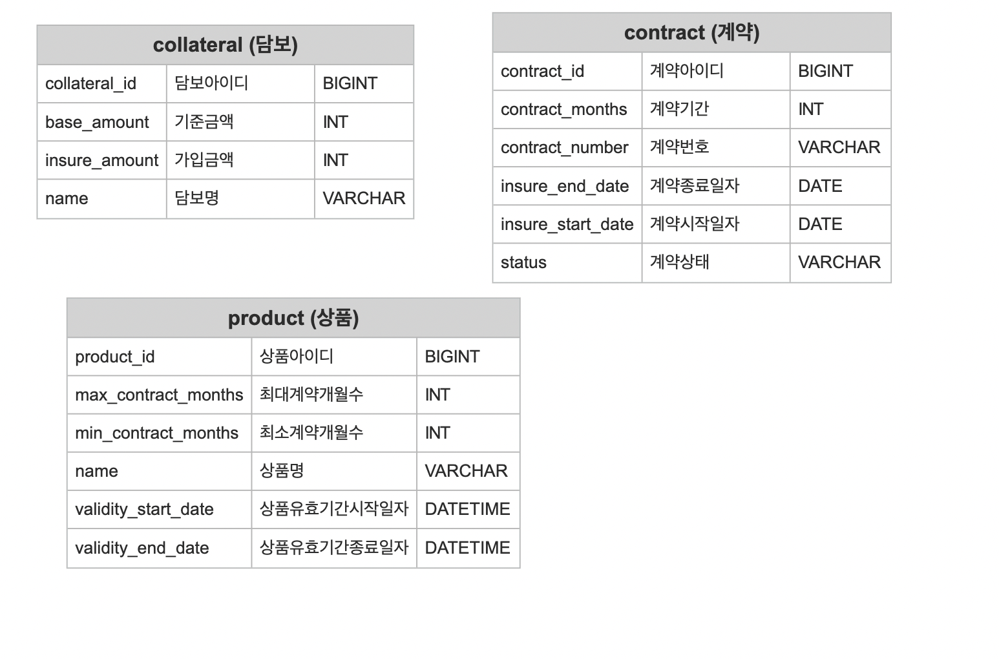

# kakao-insurance-quiz

### 1. 프로그램 실행 및 테스트 방법

------------

#### 소스 코드 가져오기
```
git clone https://github.com/kakao-insurance-quiz/20220707-yhw.git
``` 

#### 명령줄에서 실행하기
```
./gradlew build
cd build/libs
java -jar kakao-insurance-quiz-0.0.1-SNAPSHOT.jar
``` 

#### IntelliJ에서 실행하기
> IntelliJ IDEA 에서 해당 프로젝트를 가져오려면 아래 방법을 통해 가져올 수 있습니다.
> > File -> New -> Project from Existing Sources -> Clone 디렉토리로 이동 -> build.gradle 선택

> 해당 방법을 통해 프로젝트를 가져왔다면, KakaoInsuranceQuizApplication.java로 프로젝트를 실행할 수 있습니다.

#### 테스트 지원
> 해당 프로젝트는 Swagger를 통한 테스트를 지원합니다.
> > Swagger : http://localhost:9010/swagger-ui/index.html


### 2. API 명세

------------

[API 명세](API.md) 파일을 참조하세요.

### 3. 과제 요건에 대한 고민 및 접근/해결 방식

------------

 계약 관리 시스템을 개발하기 위해 업무 요건과 참고사항을 살펴보았다. 
계약 관리를 하기 위해서는 보험 계약에 대해 이해가 필요했고, 참고 사항과 용어 설명을 통해 기초적인 지식을 습득하였다. 
하나의 **계약**은 하나의 **상품**을 가지고, 그 상품이 가진 여러가지의 **담보**를 선택하여 가입하는 방식이었다. 
따라서, 계약, 상품, 담보로 구분 지었다. 
위를 토대로 데이터베이스를 설계하였고 그 데이터베이스는 아래와 같다.



상품은 상품의 계약 가능한 기간이 별도로 존재하여 최대/최소 계약 개월 수를 설정하였고, 
이에 생각이 확장되어 상품을 가입 가능한 기간이 별도로 존재하면 좋을 것 같아 상품의 유효기간을 추가하였다. 
이제 담보와 상품을 연결하려고 보니, 한 담보를 여러 상품이 사용이 가능할 것이라고 생각 되었고, 
계약 또한 상품의 모든 정보를 가지지 아니하고 특정 담보만 가입이 가능함을 확인하여 해당 부분의 테이블도 별도로 구분 지었다. 
또한 계약의 총 보험료는 담보 별 보험료의 합산과 동일하므로, 담보 별 보험료를 같이 저장한다. 


위와 같이 최종 데이터베이스를 설계하였고(공통 정보 제외) 생성된 데이터베이스를 토대로 계약관리 시스템을 개발하였다.